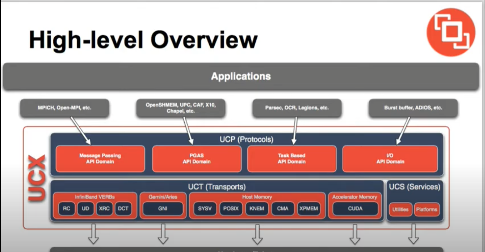

# Overview of UCX

UXC stands for Unified Communication X. It is a communication framework for high bandwidth, low latency networks.
It exposes a set of abstract communication elements and is able to offload using RDMA, TCP, GPUs, shared memory etc.

It supports resource sharing between threads, event driven progress and GPU memory handling. For GPU, UCX has both CUDA and ROCm support for Nvidia and AMD respectively.

  

Above is a high level overview of UCX from a slidecast presented by Pavel Shamis from ORNL and Gilad Shainer from Mellanox.

# Overview of RDMA

RDMA stands for Remote Direct Memory Access. It builds on previous technology that allowed access to host (CPU) memory without CPU intervention. Or in other words, it makes it possible to transfer data quickly betweem two computers. To achieve this, the storage transfer medium that RDMA operates on is a private buffer via a system network card. Processing happens via Ethernet or InfiniBand. 

RDMA is faster than SCSCI protocol via TCP (iSCSI), fiber channel and fiber channel over Ethernet (FCoE).

  

Here, you can see the path a packet would take traditionally without RDMA, and then the path it would take with RDMA. The key insight is less CPU cycles are need to process a packet since the kernel is by-passed.

# Links

[https://github.com/openucx/ucx](https://github.com/openucx/ucx)  
[https://openucx.readthedocs.io/en/master/ucx_features.html#protocols-optimizations-and-advanced-features](https://openucx.readthedocs.io/en/master/ucx_features.html#protocols-optimizations-and-advanced-features)  
[https://www.youtube.com/watch?v=lD5CYMY840A&t=212s](https://www.youtube.com/watch?v=lD5CYMY840A&t=212s)  
[https://core.vmware.com/resource/basics-remote-direct-memory-access-rdma-vsphere#section2](https://core.vmware.com/resource/basics-remote-direct-memory-access-rdma-vsphere#section2)  
[https://www.ionos.ca/digitalguide/server/know-how/what-is-remote-direct-memory-access-rdma/](https://www.ionos.ca/digitalguide/server/know-how/what-is-remote-direct-memory-access-rdma/)  
