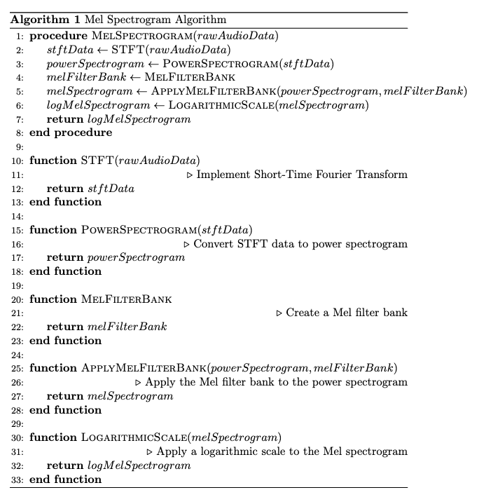

Discussion on Mel Spectogram.

# 2 — Mel Spectogram

A spectogram is a 2-D representation of an audio signal. It shows you how the spectral content of a vibration changes over time [1]. To motivate the need of turning our audio into a mel spectogram before passing it to our model. Consider a 10-second audio clip sampled at 44.1kHz. The two major adavantages for mel spectograms are the following:

* Compresssion

   To store 441,000 samples with a bit depth of 16 bits (2 bytes) per sample, which is the standard bit-depth used for uncompressed audio samples, would require 860 KB to store. The mel spectogram of the audio sample, with the appropriate parameters, could be stored in a 128x976 2-D array. Assuming 32-bit (4 bytes) floating point storage, would only require 490KB storage. Almost half of the raw audio sample.

* Feature Extraction

  Mel spectrograms capture the distribution of power across different frequency bands over time, which is often more useful for deep learning tasks.

Let us now move on to a brief review of Fourier Transforms. Recall that a signal can belong to any one of the following 4 classes:

1. Aperiodic-Continuous
    Signals that extend to both positive and negative infinity without repeating in a periodic pattern. e.g. decaying exponentials and the Gaussian curve.

2. Periodic-Continuous
    Signals that repeats itself in a regular pattern from negative to positive infinity e.g. sine waves, square waves etc.

3. Aperiodic-Discrete
    Signals only defined at discrete points between positive and negative infinity, and do not repeat themselves in a periodic fashion.

4. Periodic-Discrete
    Discrete signals that repeat themselves in a periodic fashion from negative to positive infinity. 

For digital signal processing (DSP) we are only concerned with the signals that fall under category 4. The class of Fourier Transform associated with this type of signal is known as the Discrete Fourier Transform or a (DFT). The FFT, which is a $O(n\log{}n)$ implementation of the DFT, which itself is an $O(n^2)$, algorithm is the standard for DSP applications.

To understand the behaviour of non-stationary signals, it is necessary to perform a STFT (i.e. a DFT over windowed segments of the input) to model how the frequency of the signal changes with time. We then compute a power spectrum, which is what finally produces a spectogram.

A mel spectogram has an additional filtering and logarithmic scaling step, but is otherwise the same.

Let's take a look at the pseudo-code for the algorihm below.

  

Note: If you are interested in deployment to Android, there is no off-the-shelf mel spectogram implementation, so I implemented it from scratch in Kotlin. For deployment to Apple devices see here [2].

# References
\
[1][https://medium.com/analytics-vidhya/understanding-the-mel-spectrogram-fca2afa2ce53](https://medium.com/analytics-vidhya/understanding-the-mel-spectrogram-fca2afa2ce53)
\
[2][https://developer.apple.com/documentation/accelerate/computing_the_mel_spectrum_using_linear_algebra](https://developer.apple.com/documentation/accelerate/computing_the_mel_spectrum_using_linear_algebra)
